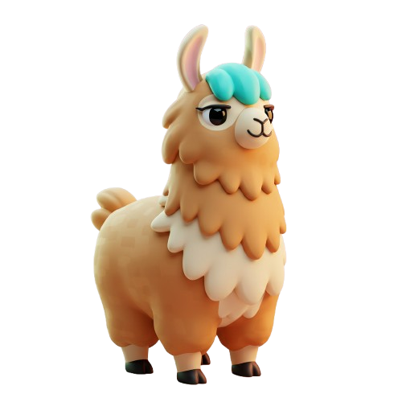

<p align="center">
    
</p>
<h1 align="center">Noko</h1>

<p align="center">
    
    
    
</p>

Noko is a user-friendly Godot plugin that facilitates seamless interaction with [Ollama](https://ollama.com/) models via API. It empowers developers to enhance their games with interactive Large Language Models (LLMs), enabling dynamic dialogues, intelligent NPCs, and more.​

- **Effortless Integration**: Quickly connect your Godot project to local Ollama models.
- **Versatile Model Support**: Compatible with various models like Gemma, LLaMA, Mistral, and others.
- **Chat Functionality**: Implement chat-based interactions with AI models.
- **Model Management**: Load, unload, and fetch model information directly within Godot.
- **Blob Handling**: Efficiently manage model blobs to optimize performance.

## 📦 Installation

1. Download Noko:
    - Clone or download the repository.
    - Copy the `addons/noko` directory into your Godot project's `addons` folder.​

2. Enable the Plugin:
    - Open your project in Godot.
    - Navigate to `Project > Project Settings > Plugins`.
    - Locate **Noko** in the list and click **Enable**.​

## 🚀 Getting Started

Ensure you have Ollama installed and running with your desired model.​

Here's a basic example of using Noko to interact with a model:

```gdscript
extends SceneTree

# Preload the NokoModel module, which provides
# functions to manage AI models.
const NokoModel = preload("res://modules/NokoModel.gd")

# Preload the NokoPrompt module, which provides functions
# to interact with AI models via prompts.
const NokoPrompt = preload("res://modules/NokoPrompt.gd")

func _init():
    # Defer the execution of _start_request to ensure
    # the scene tree is fully initialized.
    call_deferred("_start_request")

func _start_request():
    # Retrieve the root node of the scene tree.
    var root = get_root()

    # Define the name of the AI model to use.
    var model = "gemma3"

    # Define the conversation history as a list of message dictionaries.
    var prompt = [
        {
            "role": "user",
            "content": "Hello! I am Nathanne."
        },
        {
            "role": "assistant",
            "content": "Hello, Nathanne. I am Gemma, an AI assistant developed by Google DeepMind."
        },
        {
            "role": "user",
            "content": "Can you tell me back my name? (Answer in one sentence only)"
        }
    ]

    # Define the server details where the AI model is hosted.
    var server = {
        "host": "http://localhost", # Server host address.
        "port": 11434               # Server port number.
    }

    # Asynchronously load the specified chat model on the server.
    if await NokoModel.load_chat_model(root, server, model, false):
        print("Successfully loaded model: " + model)
    else:
        print("Something went wrong trying to load model: " + model)
        quit()  # Terminate the application if loading fails.

    # Asynchronously send the conversation prompt
    # to the AI model and await the response.
    var generated = await NokoPrompt.chat(
        root,
        server,
        "gemma3",
        prompt
    )

    # Output the user's last message.
    print("Me:\t" + prompt[2]["content"])

    # Output the assistant's response from the AI model.
    print("Gemma:\t" + generated["body"]["message"]["content"])

    # Asynchronously unload the chat model from the server to free up resources.
    if await NokoModel.unload_chat_model(root, server, model, false):
        print("Successfully unloaded model: " + model)
    else:
        print("Something went wrong trying to unload model: " + model)

    # Terminate the application after the interaction is complete.
    quit()
```

## 📚 Documentation

Noko provides several modules to interact with Ollama models:​

- [`NokoModel.gd`](modules/NokoModel.gd): Functions to load, unload, and fetch information about models.
- [`NokoPrompt.gd`](modules/NokoPrompt.gd): Handles sending prompts and receiving responses from models.
- [`NokoRunner.gd`](modules/NokoRunner.gd): Utilities to check the status and version of the Ollama runner.
- [`NokoBlobs.gd`](modules/NokoModel.gd): Manages model blobs for efficient performance.​

Each module is documented with inline comments to guide you through their functionalities.

## 🛠️ Requirements

1. [Godot Engine 4.4.x](https://godotengine.org) or higher.
2. [Ollama](https://ollama.com) installed and running with your chosen model.

## 📄 License

This project is licensed under the **MIT License**. See the [LICENSE](LICENSE) file for details.
